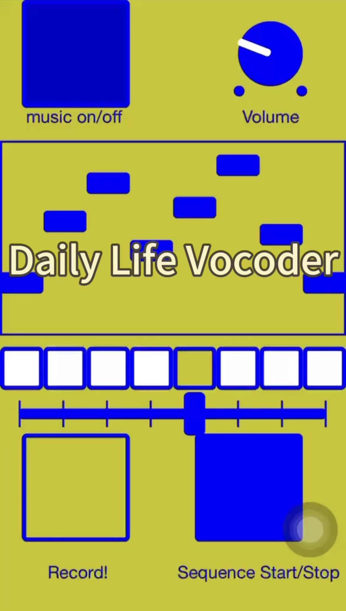

<!-- PROJECT LOGO -->
 

<!--    -->
  

  <h3 align="center">Daily Life Vocoder</h3>

  

    An in-situ timbre exploration tool!
     
    <a href="https://www.youtube.com/shorts/r5UcnywTU4c">View Demo</a>
    ·
    <a href="https://github.com/li630925405/daily-life-vocoder/issues">Report Bug</a>
    ·
    <a href="https://github.com/li630925405/daily-life-vocoder/issues">Request Feature</a>
  

<!-- PROJECT SHIELDS -->
[![MIT License][license-shield]][license-url]

## About this Project

Do you want to hear your memory blending with music?

Do you want to transform your daily moment to an effect chain?

This project is a vocoder sequencer that convolves music with any sounds. As it supports mobile platform, it can be conveniently used for in-situ exploration in daily life. It's aimed to be a portable timbre exploration tool. With microphone input, you can capture the moments in life and apply it to music, sensing the world in timbre perspective. 

## Getting Started
1. Download MobMuPlat on your phone.

    For iOS user, you can get it from AppStore: https://apps.apple.com/us/app/mobmuplat/id597679399?platform=iphone
    
    For Android user, you can get it from Google Play : https://play.google.com/store/apps/details?id=com.iglesiaintermedia.mobmuplat
    or download APK directly on its website.

2. Unzip our project into the MobMuPlat folder on your phone.
3. Run the app. Click on the file "ConvTimbre.mmp" and you'll be able to run this project!

In this project we use [Mobmuplat](https://danieliglesia.com/mobmuplat/) Editor to design and test our GUI and interaction. Mobmuplat is a standalone iOS+Android app which supports interact with [PureData](https://puredata.info/) patches with a neat graphical use interface and mobile hardware input.

## Technical Details

### What it is
A vocoder is an audio effect that lets you impose the dynamics and changing spectral content of one sound (the modulator) onto another (the carrier). The modulator is usually the human voice, speaking or singing, while the carrier is usually a bright synthesizer. [1]

Here we generalize the modulator to any sounds and the carrier to an existing music piece.

### How it works

+ a piece of music played in loop as carrier (banks/elephant.wav [2])
+ 8 sound tracks extracted from daily videos as 8 modulators (banks/0.wav - 8.wav)  
  You can change 0.wav - 8.wav to your own sound tracks.
+ The carrier is cut to a 8 steps' sequencer.
+ In each step, a modulator is chosen from 8 modulators, and the carrier is convoled with the modulator, so that the carrier’s timbre is changed by different modulators as the sequencer steps.

### How to use
+ tilting the phone left and right changes the playback speed of the music (left slow; right fast)
+ tilting the phone up and down changes the volume (up: loud; down: low)
+ 8 grids at each step — choose which modulator to use at the current step (top: 0; bottom: 7)
+ trigger button at each step — trigger on to enbale vocoder, trigger off to disable vocoder (wihte: trigger on; transparent: trigger off)

<!-- CONTACT -->
## Contact

Yazhou Li - yazhou.li@qmul.ac.uk  
Yutian Hu - yutianhu@hotmail.com

<!-- ACKNOWLEDGMENTS -->
## Acknowledgments

Thanks to the [Timbre Tools Hackathon](https://comma.eecs.qmul.ac.uk/timbre-tools-hackathon/) organised by C4DM's [Communication Acoustics Lab](https://comma.eecs.qmul.ac.uk/) from where we shape this idea.

## Reference
[1] https://cecm.indiana.edu/361/rsn-vocoder.html#:~:text=A%20vocoder%20is%20an%20audio,is%20usually%20a%20bright%20synthesizer
[2] The music used is adapted from 'elephant' by Loke Rahbek

<!-- MARKDOWN LINKS & IMAGES -->
[license-shield]: https://img.shields.io/github/license/othneildrew/Best-README-Template.svg?style=for-the-badge
[license-url]: https://github.com/li630925405/daily-life-vocoder/blob/main/LICENSE.txt
